# Decouverte de vim (ou plutot neovim :))

## L'interface et les bases

### L'interface

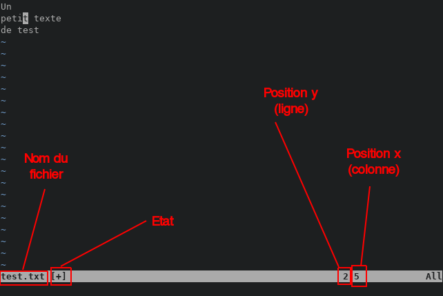

### Les bases

#### La notion de modes

`Normal`: Déplacements rapides, de modifications rapides...

`Insertion`: Insertion de textes

`Remplacement`: Remplacer du texte

`Visual`: Sélection

`Visual-block`: Sélection en bloc

### Les raccourcis de base

Les raccourcis sont utilisables en mode `normal`, `visual` et `visual-block`

#### Le deplacement

Possible de se déplacer avec les flèches

Cependant il est conseillé d'utiliser les raccourcis suivants:

`h`: Gauche

`j`: Bas

`k`: Haut

`l`: Droite

`w`: Aller au début du prochain mot

`e`: Aller à la fin du mot sur lequel est le curseur

`b`: Aller au début du mot sur lequel est le curseur

#### Écrire du texte

`i`: Passer en mode insertion avant le curseur

`a`: Passer en mode insertion après le curseur

`s`: Supprimer le caractère sous le curseur et passer en mode insertion

`I`: Passer en mode insertion au début de la ligne

`A`: Passer en mode insertion à la fin de la ligne

`S`: Supprimer la ligne actuelle et passer en mode insertion

`r`: Remplacer le caractère sur lequel est positionné le curseur

`R`: Passer en mode remplacement

`J`: Fusionner la ligne actuelle et celle d'en dessous

#### Presse-papier

`yy`: Copier la ligne actuelle

`dd`: Couper la ligne actuelle

`p`: Coller après le curseur

`P`: Copier avant le curseur

`x`: Couper le caractère sous le curseur

`X`: Couper le caractère avant le curseur

`s` et `S` gardent les éléments supprimés dans le presse-papier

#### Navigation

`gg`: Aller au début du fichier

`G`: Aller à la fin du fichier

`H`: Aller à la première ligne affichée

`L`: Aller à la dernière ligne affichée

`:`: Aller à la ligne avec un numéro

#### Recherche

`/`: Rechercher une string

`n`: Aller à la prochaine occurrence

`N`: Aller à la précédente occurrence

`f`: Rechercher dans la ligne et déplacer le curseur sur la première occurrence

`t`: Rechercher dans la ligne et déplacer le curseur avant la première occurrence

`*`: Surligner le mot sur lequel est positionné le curseur

#### Autre

`u`: Annuler (`Ctrl + z`)

`Ctrl + R`: Refaire (`Ctrl + y`)

`<Esc>`: Passer en mode normal

#### La combinaison

Vim propose de combiner ces raccourcis afin d'augmenter la puissance de ceux-ci

`dj`: Couper la ligne actuelle et celle d'en dessous

Il est possible de combiner quasiment tous les raccourcis entre eux

Il est aussi possible d'utiliser des chiffres avec ces raccourcis

Par exemple

`<nbr>j`: Allez à `nbr` lignes après, de même avec h, k et l (tous les déplacements en somme)

On peut donc faire `d3j` pour couper la ligne actuelle et les trois d'en dessous

Et `d3k` pour au-dessus

`d3l` pour couper le caractère sous le curseur et les trois sur sa droite, pareil pour `h`

`dfl`: Pour couper jusqu'au prochain `l` dans la ligne

Essayer par exemple, de trouver la combinaison des raccourcis pour:

<details>
    <summary>Supprimer le contenu entre des guillemets " à partir du curseur</summary>

    dt"

</details>

<details>
    <summary>Supprimer de la position du curseur jusqu'à la fin du fichier</summary>

    dG

</details>

<details>
    <summary>Copier les trois mots après le curseur</summary>

    y3w

</details>

<br/>

En bref, il est possible de faire beauuuuuuuucoup de combinaisons

### Les commandes de base

Les commandes commencent toutes par `:` car on rentre ainsi dans le mode `commande`

`:w`: Sauvegarder

`:q`: Quitter

`:x`: Sauvegarder et quitter

`:noh`: Désactiver le 'surlignage' des recherches

`:h`: Ouvrir une page d'aide sur un sujet

`:vs`: Ouvrir une deuxième fenêtre

`:ls`: Lister les buffers ouverts

`:b`: Changer de buffer

`:%s`: Rechercher et remplacer

### Les macros

Les macros permettent d'enregistrer une suite d'actions et de les refaires

Les macros sont identifiées par une lettre

Pour enregistrer une macro, il suffit en mode normal, d'appuyer sur `q` puis sur la lettre correspondant à la macro

Ensuite il suffit d'exécuter des actions, puis d'appuyer sur `q` pour finir l'enregistrement

Pour utiliser une macro, il faut utiliser un `@` puis la lettre qui correspond à la macro

## La configuration

Vim est configurable (et heureusement, sinon ça serait bien nul)

Pour vim de base, le fichier de configuration est `~/.vimrc`

Dans notre cas, pour neovim, ce sera `~/.config/nvim/init.vim`

C'est ici que l'on peut configurer vim

Pour plus d'informations sur ces configurations, vous avez mes dotfiles à disposition qui vous expliquent tous comme il faut

## Comment faire de vim un vrai IDE en utilisant des plugins

La vraie force de vim, au-delà de ça, c'est les plugins

Ces plugins sont écrits en vimscript (lua) et sont créés par des utilisateurs

Pour les installer, il existe plusieurs méthodes

- La plupart des plugins proposent une méthode d'installation sur leur github

- Un plugin manager

Un plugin manager est un plugin lui aussi, qu'il va falloir installer à la main (pas le choix)

Et qui va permettre d'installer et de désinstaller des plugins très facilement

Il existe pas mal de plugin managers: `vimplug`, `vundle`, `pathogen`

Mais celui que j'utilise et recommande est `vimplug`

Pour l'installer, il faut suivre les instructions sur 

Il existe deux catégories de plugins

<details>
    <summary>Les plugins passifs, qui tournent en arrière plan</summary>

    La plupart du temps, ces plugins affichent des informations ou facilitent la vision de l'utilisateur

</details>

<br/>

<details>
    <summary>Les plugins actifs, qui se lancent lors d'une action de l'utilisateur</summary>

    Ces plugins ne font des actions uniquement quand l'utilisateur le demande

    Pour cela, les plugins actifs utilisent des commandes, par exemple :MakeHeader

    Le problème ici, c'est que taper des commandes, c'est long et chiant

    Vim permet donc de faciliter l'utilisation de ces commandes

</details>

## Comment faire ses propres raccourcis

Pour faire ses propres raccourcis, il faut relier une commande (`:command`) à une combinaison de touches

La syntaxe et la suivante:

`<mode>map` `<combinaison de touches>` `<commandes>`

Par exemple

```vim
map <C-n> :NERDTreeToggle<CR>
```

## Quelques plugins utiles

### Vimplug

[Github](https://github.com/junegunn/vim-plug)

Vimplug est le plugin qui permet de gérer facilement l'installation et la suppression d'autres plugins

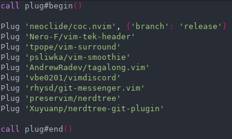

### Coc

[Github](https://github.com/neoclide/coc.nvim)

Coc est un plugin d'autocompletion

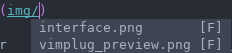

### Vim tek-header

[Github](https://github.com/Nero-F/vim-tek-header)

Vim tek-header est un plugin qui permet de générer les headers Epitech automatiquement

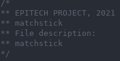

### Auto pairs

[Github](https://github.com/jiangmiao/auto-pairs)

Auto pairs ferme automatiquement les délimiteurs de blocs (`()`, `[]`, `""`, `''`...)

Ce plugin facilite également la navigation dans ces délimiteurs et leur identification

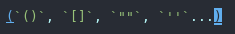

### Vim airline

[Github](https://github.com/vim-airline/vim-airline)

Airline permet d'avoir plein d'informations sur le fichier facilement (et joliment surtout :))


### Onedark

[Github](https://github.com/joshdick/onedark.vim)

One dark est un thème de couleur

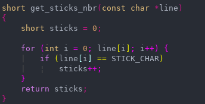

### Vim surround

[Github](https://github.com/tpope/vim-surround)

Vim surround est un plugin qui facilite l'utilisation des délimiteurs (", ', {}, []...)

### Vim smoothie

[Github](https://github.com/psliwka/vim-smoothie)

Vim smoothie est un plugin qui rend plus fluide les déplacements dans un fichier

### Tagalong

[Github](https://github.com/AndrewRadev/tagalong.vim)

Tagalong permet d'auto-fermer/auto-modifier des balises html

### Vim discord

[Github](https://github.com/vbe0201/vimdiscord)

Vim discord permet de faire une activité vim sur discord

### Git messenger

[Github](https://github.com/rhysd/git-messenger.vim)

Git messenger affiche l'historique des commits d'une section de code

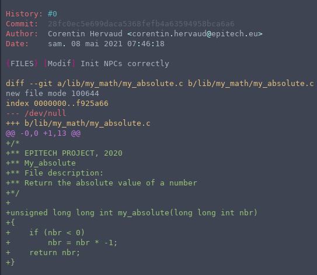

### Nerdtree

[Github](https://github.com/preservim/nerdtree)

Nerdtree est un plugin qui permet d'avoir un arbre de fichiers

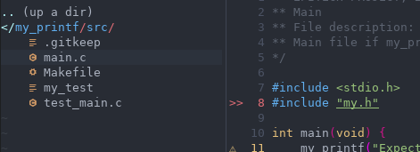

### Nerdtree git

[Github](https://github.com/Xuyuanp/nerdtree-git-plugin)

Nerdtree-git affiche des icônes suivant le statut git des fichiers

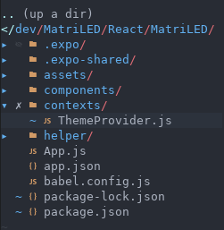

### Vim arduino

[Github](https://github.com/stevearc/vim-arduino)

Vim arduino permet d'utiliser un arduino directement avec vim

### Indentline

[Github](https://github.com/yggdroot/indentline)

Indentline rends les tabulations plus visibles et lisibles

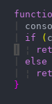

### Vimspector

[Github](https://github.com/puremourning/vimspector)

Vimspector est un débugger sur vim

### Vim devicons

[Github](https://github.com/ryanoasis/vim-devicons)

Vim devicons permet d'avoir de jolis icônes

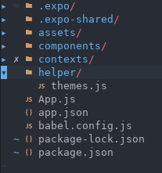

### Vim JSX pretty

[Github](https://github.com/maxmellon/vim-jsx-pretty)

Ce plugin rends du code jsx joli

### Vim rainbow

[Github](https://github.com/frazrepo/vim-rainbow)

Permet de mettre des couleurs pour identifier les séparateurs

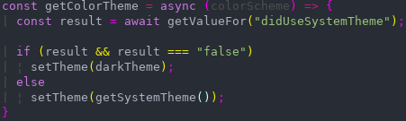

### Vim better whitespace

[Github](https://github.com/ntpeters/vim-better-whitespace)

Permet d'identifier les espaces en trop

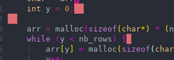

### Vim gitgutter

[Github](https://github.com/airblade/vim-gitgutter)

Ce plugin permet d'identifier rapidement les modifications git sur un fichier

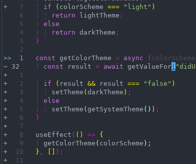

### Vim CSS color

[Github](https://github.com/ap/vim-css-color)

Vim css color permet d'avoir un rendu en direct des couleurs

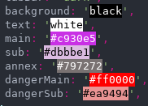

### Markdown preview

[Github](https://github.com/iamcco/markdown-preview.nvim)

Ce plugin permet d'avoir une vue en direct d'un fichier markdown

### Tabnine

[Github](https://github.com/codota/tabnine-vim)

Tabnine est un plugin qui permet d'améliorer l'autocompletion

### NerdCommenter

[Github](https://github.com/preservim/nerdcommenter)

Nerdcommenter permet de faciliter l'utilisation des commentaires

### Vim Cmake

[Github](https://github.com/cdelledonne/vim-cmake)

Vim cmake est un gestionnaire de Makefile dans vim

### Instant nvim

[Github](https://github.com/jbyuki/instant.nvim)

Intant vim est un plugin qui permet de faire de l'édition collaborative

## Comment bien configurer de nouveaux plugins

Pour bien configurer un plugin, il est recommandé de lire entièrement leurs documentations sur leurs githubs respectifs

Il est également recommandé de séparer les configurations des plugins par fichiers

## Des petits tips

Pour faciliter le passage en mode normal, on peut 'mapper' `<Esc>` sur une combinaison

La plupart des gens le map sur la combinaison de lettres `jk`

Dès que vous pensez que quelque chose qu'il serait utile d'avoir sur vim, cherchez sur internet

Il y a énormément de plugins vim, et bien souvent, le truc auquel vous pensez, bah ça existe

## En bref

Comme vous avez pu le comprendre, vim est fait pour aller vite

Cependant, il est nécessaire de passer du temps sur sa configuration pour qu'il soit de plus en plus efficace

Si vous voulez vous documenter un peu plus sur vim et sur les plugins que je viens de vous montrer

Voici le lien de mes Dotfiles (ils contiennent de la doc sur les plugins) (Coming soon)

Je vous donne aussi le lien de ce fichier: (Comming soon)

## Maintenant, la pratique !

Maintenant que vous avez toutes ces infos, je vous laisse configurer votre vim comme vous le souhaitez

Servez vous des liens pour faire votre configuration

Je suis là pour répondre à vos questions ou si vous avez des problèmes
